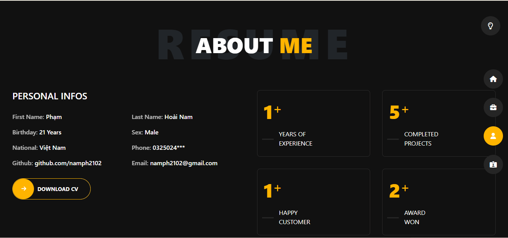

"# portfolio" 
 <h3>MY Portfolio is not compeleted</h3>
 
Thanks for your visited

<ul>
    <li>
        <h4>Home</h4>
         <figure>
            
             <figcaption>Page Home</figcaption>
        </figure>
    </li>
     <li>
        <h4>About Me</h4>
         <figure>
            
             <figcaption>Page About</figcaption>
        </figure>
    </li>
</ul>